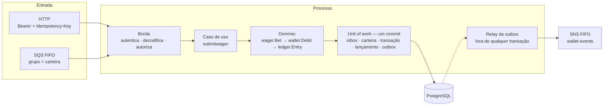

# Arquitetura

Serviço de liquidação de apostas para casas de jogo. Um **provedor** envia operações — aposta, ganho, perda, estorno, cancelamento — por HTTP ou por uma fila FIFO; o serviço debita e credita a **carteira** do jogador, grava cada movimento num **ledger** imutável e publica o desfecho como evento. É um único bounded context, um único binário, N réplicas iguais atrás de um PostgreSQL compartilhado.

O que ele garante, e que o resto deste documento explica como: o saldo nunca fica negativo, mesmo com réplicas concorrendo pela mesma carteira; a mesma operação enviada duas vezes produz um efeito só; todo movimento tem um lançamento que o explica; e nenhum evento sai antes do commit que o causou.

## Como ler

| Quero saber | Onde |
| --- | --- |
| quem fala com o sistema, do que ele é feito, o que configura | [01 · Contexto e containers](docs/01-contexto.md) |
| os agregados, os seis tipos de operação, o ciclo de vida | [02 · Domínio](docs/02-dominio.md) |
| as cinco tabelas, as invariantes, as migrations | [03 · Dados](docs/03-dados.md) |
| o que acontece, passo a passo, numa aposta, num replay, numa corrida, numa espera | [04 · Fluxos](docs/04-fluxos.md) |
| como um erro viaja, quem pode o quê, o que sai em log, como o processo sobe e desce | [05 · Transversais](docs/05-transversais.md) |
| o que falta, o que é guarda, o que custa | [06 · Riscos e limitações](docs/06-riscos-e-limitacoes.md) |
| por que foi feito assim, e o que foi rejeitado | [Decisões](docs/adr/README.md) |
| subir, testar, chamar as rotas | [README](README.md) |

Cada tipo de conteúdo tem um lugar só. Estrutura muda com o código e mora em `docs/0X`. Uma decisão nunca é editada: quando muda, outra a substitui, e a antiga fica. Este arquivo é a visão de cima; quando uma frase aqui toca algo que tem documento próprio, o link está na frase.

## Uma operação, de ponta a ponta



Os dois canais convergem no mesmo caso de uso e produzem o mesmo hash de negócio, então uma operação que chega por HTTP e é reenviada pela fila é reconhecida como a mesma. O caso de uso não decide regra: ele fixa a ordem — chave, lock da carteira, operação citada, função do kind, escrita — e essa ordem é o que separa uma recusa sem linha de uma rejeição que grava ([04 · Fluxos](docs/04-fluxos.md)).

## Estilo arquitetural

### Portas e adaptadores, em três camadas

```
internal/platform  →  internal/app  →  internal/domain
   adaptadores        casos de uso       regras
```

A seta nunca aponta para cima. O domínio importa a biblioteca padrão e a si mesmo — nenhum `pgx`, nenhum `net/http`, nenhum Fx. Os casos de uso importam o domínio e **declaram as portas que precisam** como interfaces pequenas, no próprio pacote consumidor: `storage.UnitOfWork`, `submitwager.Minter`, `submitwager.Clock`. Os adaptadores implementam essas portas e o composition root as injeta; `internal/platform/app` é o único pacote que conhece o Uber Fx. A consequência prática: um teste de unidade de um caso de uso nunca precisa de banco, e trocar o PostgreSQL por outro adaptador não toca `internal/app` nem `internal/domain` ([01 · Contexto](docs/01-contexto.md)).

O mesmo princípio vale para erros: a borda HTTP declara as interfaces de comportamento que procura (`retryable`, `defective`, `replayed`), e os erros do caso de uso as satisfazem sem saber que a borda existe ([ADR 0008](docs/adr/0008-interfaces-de-comportamento-no-consumidor.md)).

### DDD tático — o que usamos

- **Um bounded context**: liquidação. WebSocket, S3 e um segundo serviço ficam fora.
- **Duas raízes de agregado ligadas por identidade**: `Wallet` guarda saldo e versão; `WagerTransaction` guarda o pedido do provedor e o que aconteceu com ele, e referencia a carteira pelo id — nunca pelo ponteiro. Cada uma é carregada, travada e gravada por si ([02 · Domínio](docs/02-dominio.md)).
- **Objetos de valor em tudo que o compilador pode proteger**: `Money` é `int64` de centavos com a moeda no tipo; cada identificador é um tipo próprio, e um `WalletID` não entra onde se espera um `PlayerID`. `string` e `uuid.UUID` soltos param na borda, no parse.
- **Zero value inválido**: `Money{}`, `Wallet{}`, `Transaction{}` não são valores de negócio. Construção só por construtor; reidratação é função separada que não reaplica movimento nem emite evento.
- **Uma função de domínio por tipo de operação** — `Bet`, `Win`, `Loss`, `Refund`, `Rollback` — em vez de um *domain service*. Nenhuma calcula saldo: quem calcula é `Wallet.move`, único escritor do saldo. O caso de uso escolhe a função pelo `kind` e não faz mais nada com ele.
- **Um caso de uso por pacote**: `openwallet`, `submitwager`, `resolvereference`, `relayoutbox`, `receivewager`, e as leituras.
- **Leituras fora do agregado**: `readwallet`, `readwager`, `listledger` e `reconcilewallet` devolvem modelos de leitura direto do SQL, sem reidratar nem chamar `Debit`. Uma leitura não move dinheiro e não paga por um agregado — nem a reconciliação, que o enunciado pede em `POST` ([ADR 0029](docs/adr/0029-contrato-http-segue-o-enunciado.md)). A reconciliação lê os dois saldos numa sentença só e decide o veredito no caso de uso ([ADR 0022](docs/adr/0022-reconciliacao-em-uma-sentenca-com-veredito-no-caso-de-uso.md)); o extrato continua de um cursor opaco amarrado à carteira ([ADR 0023](docs/adr/0023-cursor-opaco-amarrado-a-carteira.md)).

### DDD tático — o que não usamos, de propósito

- **Repositório dentro do domínio.** As portas de persistência estão em `internal/app/storage`, e só são alcançáveis de dentro de uma unit of work: uma escrita fora do commit não é expressável no sistema de tipos.
- **Eventos acumulados no agregado.** O agregado não guarda uma lista de eventos pendentes. Uma função do domínio, `event.Of`, lê o estado da transação e o movimento no fim do commit e responde os envelopes; a outbox é infraestrutura do commit, não estado do agregado.
- **Camada de serviço genérica.** Não existe `WalletService` com vinte métodos. Cada pacote de caso de uso tem um `Service` com um método público.
- **Máquina de estados por `switch`.** A transição válida é uma tabela de duas linhas; um status terminal está simplesmente ausente dela.

### O banco é o árbitro

O que duas réplicas poderiam decidir diferente é decidido pelo PostgreSQL, e nunca por uma consulta que ambas poderiam passar ao mesmo tempo:

- A **idempotência** é dois índices únicos. Quem perde a inserção relê a linha vencedora e responde replay ou conflito ([ADR 0001](docs/adr/0001-indice-unico-como-arbitro-da-idempotencia.md)).
- O **saldo** é `SELECT … FOR UPDATE` antes de decidir, mais a versão lida como condição do `UPDATE` ([ADR 0002](docs/adr/0002-lock-pessimista-com-guarda-de-versao.md)).
- A **máquina de estados**, o acoplamento entre tipo e quantia e a coerência do lançamento com a transação são `CHECK` e chave estrangeira composta ([03 · Dados](docs/03-dados.md)). O agregado afirma as mesmas invariantes em Go; o banco tem a palavra final.

Os cenários obrigatórios do enunciado provam isso com várias instâncias independentes do processo sobre o mesmo banco, cada uma com o próprio grafo, pool e porta ([ADR 0027](docs/adr/0027-instancias-como-grafos-do-fx-no-binario-de-teste.md)); a morte entre o commit e a remoção da mensagem, e a contagem de cada evento publicado, acontecem na rede entre a instância e o broker ([ADR 0028](docs/adr/0028-falha-e-contagem-na-fronteira-de-rede-do-broker.md)).

### Um commit

A memória da mensagem (inbox), o saldo, a linha da transação, o lançamento e os eventos (outbox) entram na mesma transação SQL, em `READ COMMITTED`. Uma rejeição de negócio **commita** a própria linha `REJECTED` e ainda assim sai como `422` — a recusa viaja ao lado do resultado, não como erro da unit of work ([ADR 0004](docs/adr/0004-rejeicao-duravel-ao-lado-do-resultado.md)). O corpo, em problem details, leva a identidade dessa linha na extensão `transactionId`, e é a única divergência deliberada do contrato do enunciado ([ADR 0029](docs/adr/0029-contrato-http-segue-o-enunciado.md)). Falha transitória desfaz tudo e tenta de novo. Nada é publicado antes do commit: o relay lê a outbox depois, reivindica por lease e publica fora de qualquer transação ([ADR 0013](docs/adr/0013-publicar-fora-da-transacao-sob-lease.md)).

### Duas classes de erro

Rejeição de negócio é resultado esperado: carrega um token de um catálogo fechado, deixa o span ok e não tem stack. Falha de infraestrutura é o que não devia acontecer: tem stack capturada uma vez, marca o span e não tem token. As duas nunca se embrulham uma na outra, e a borda as separa com `errors.As` ([05 · Transversais](docs/05-transversais.md), [ADR 0007](docs/adr/0007-catalogo-fechado-de-failure-code.md), [ADR 0010](docs/adr/0010-stack-capturada-uma-vez.md)).

### O que se vê no código

Funções curtas — o teto de complexidade ciclomática é 6 e o CI o aplica —, o que explica a quantidade de funções de três linhas com nome próprio. Campos privados sem setter: o estado sai no retorno de `Open`, `Debit` e `Credit`. Todo texto dentro de `.go` é inglês, e o comentário de corpo carrega o porquê, não o quê; quando o porquê precisa de mais de três linhas, ele mora num ADR e o comentário aponta pelo número. Erro é valor: sentinela quando não carrega dado, tipo quando carrega, `panic` nunca representa rejeição.

## Estrutura de pastas

```
cmd/wager/                 o main: sinais do SO, config, e entrega ao composition root

internal/domain/           regras — importa só a biblioteca padrão e a si mesmo
  money/                   Money: int64 de centavos, moeda no tipo, parse e aritmética com overflow
  identity/                um tipo por identificador; os nossos são UUID, os do provedor são opacos
  wallet/                  Wallet: Open, Debit, Credit, e o move que é o único escritor do saldo
  ledger/                  Entry: o lançamento imutável, e Direction, que decide o sinal
  wager/                   Transaction, Kind, Status, FailureCode, e as funções Bet/Win/Loss/Refund/Rollback
  event/                   os quatro eventos e o Commit que decide quais um desfecho emite

internal/app/              casos de uso — importam o domínio e declaram as portas
  storage/                 as portas: UnitOfWork, Tx, Wallets, Transactions, Entries, Outbox, Inbox, Reads
  submitwager/             liquida uma operação em um commit; HTTP e fila chegam aqui
  openwallet/              abre a carteira, com a OPENING e o lançamento quando o saldo inicial é positivo
  resolvereference/        fecha uma espera por referência: credita, rejeita ou reagenda
  relayoutbox/             o turno do relay: reivindica, publica, confirma
  receivewager/            o que a fila acrescenta à submissão: remetente e memória da mensagem
  readwallet/ readwager/   as leituras, em modelo de leitura
  listledger/              o extrato paginado: o cursor opaco e a página de limit + 1
  reconcilewallet/         o veredito da reconciliação sobre os agregados que o SQL devolve
  bodyhash/                o hash canônico do negócio, igual pelos dois canais
  referencewait/           a política da espera: prazo e backoff, compartilhada por quem abre e por quem fecha

internal/platform/         adaptadores — a única camada que conhece pgx, HTTP, AWS e Fx
  app/                     composition root: o grafo do Fx, o ciclo de vida, as fatias de prazo
  config/                  variáveis de ambiente, lidas e validadas antes de qualquer porta abrir
  httpapi/                 servidor, mux, span da entrada, métrica de latência, health
  wagerapi/ walletapi/     as bordas de cada recurso: decodificam, autorizam, chamam, respondem
  authz/                   token do Keycloak, claim azp, mapa de clientes, papel por rota
  problem/                 o corpo de erro RFC 9457 e o mapa de status — o único lugar com números HTTP
  fault/                   a stack de uma falha de infraestrutura, capturada uma vez
  postgres/                pool, unit of work, repositórios, e a fronteira que classifica o erro do pgx
  broker/                  os clientes SQS e SNS, credenciais e endpoint local
  wagerqueue/              o consumidor da fila: long poll, decisão por mensagem, DLQ
  outboxrelay/             o ticker do relay
  referenceworker/         o ticker do worker de referência
  divergencewatch/         o observador de divergência: varre as carteiras por página e só lê
  metrics/                 o registro único das séries de negócio, com rótulos de conjunto fechado
  telemetry/               OTLP, log JSON com lista branca de campos, Prometheus
  probe/                   as sondas de readiness
  mint/ clock/             UUIDv7 e relógio em UTC, injetados para o domínio nunca os chamar

internal/e2e/              a suíte de jornada, por área, sob a tag integration; scenarios/ são os
                           oito cenários de concorrência do enunciado, sobre várias instâncias
internal/suiteenv/         o que toda suíte de jornada precisa para alcançar o ambiente

deploy/
  migrations/              o SQL versionado, aplicado uma vez antes das réplicas
  terraform/localstack/    filas, tópico e papel IAM do remetente
  keycloak/                o realm de desenvolvimento
  local/                   os mapas versionados: clientes e remetentes
  otel/ tempo/ loki/ prometheus/ grafana/   a stack de observabilidade do Compose, com o painel
                           "Liquidação" e as duas regras de alerta

scripts/
  testgates/               os pisos de cobertura que o CI aplica, por pacote
  envcheck/                confere o ambiente local contra os arquivos versionados: migrations, realm,
                           broker, imagem, painel e regras de alerta

docs/                      esta documentação; docs/adr/ é o registro de decisões
compose.yaml  Dockerfile  Makefile
```

Cada pacote de `internal/domain` e `internal/app` tem um assunto e um nome que é o assunto. Não há `utils`, `common` nem `helpers`.

## Invariantes que não se negociam

Uma linha cada, com o lugar onde está garantida:

- **O saldo nunca fica negativo** — no agregado antes de atribuir, e no `CHECK` da coluna ([02](docs/02-dominio.md), [03](docs/03-dados.md)).
- **A mesma operação produz um efeito só** — dois índices únicos, e a perdedora relê a vencedora ([ADR 0001](docs/adr/0001-indice-unico-como-arbitro-da-idempotencia.md)).
- **Todo movimento tem um lançamento, e o lançamento não muda** — nasce em `Wallet.move`; a tabela só aceita `INSERT`, por gatilho e por `GRANT` ([03](docs/03-dados.md)).
- **No commit, o saldo é o `balance_after` do último lançamento** — gatilho diferido ([03](docs/03-dados.md)).
- **`PENDING` nunca chega ao disco** — só existe em memória, e o `CHECK` recusa gravá-lo ([02](docs/02-dominio.md)).
- **Cada operação aceita uma reversão** — decidido pela consulta sob o lock; o índice parcial é a invariante ([ADR 0003](docs/adr/0003-already-reversed-decidido-sob-o-lock.md)).
- **`failureCode` só sai do catálogo** — `NewRejection` recusa o que não está nele ([ADR 0007](docs/adr/0007-catalogo-fechado-de-failure-code.md)).
- **Nada é publicado antes do commit** — o relay lê a outbox depois ([ADR 0013](docs/adr/0013-publicar-fora-da-transacao-sob-lease.md)).
- **O `providerId` do corpo ou da URL não autoriza** — vale o cliente do token, cruzado com o mapa ([05](docs/05-transversais.md)).
- **Nenhum `float` toca dinheiro, e nenhum valor financeiro toca o log** — `Money` é `int64`; o handler de log descarta atributo fora da lista branca ([05](docs/05-transversais.md)).
