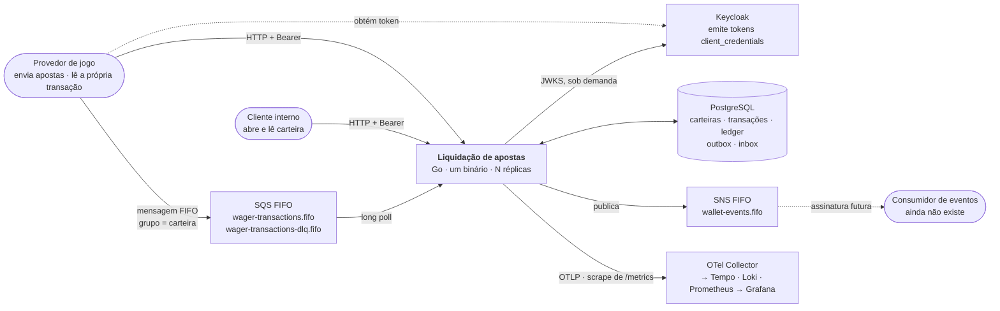
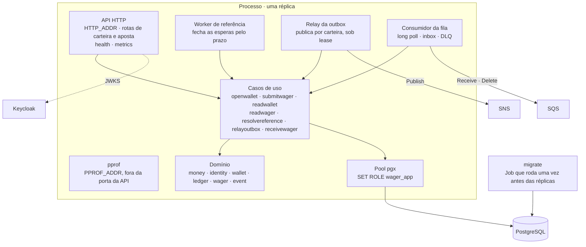

# Contexto e containers

O serviço é um bounded context, um binário e N réplicas. Esta página é o nível 1 e o nível 2 do modelo C4: quem fala com o sistema, e do que o sistema é feito por dentro.

## Nível 1 — o sistema e quem o cerca

Duas identidades entram pelo HTTP, e a diferença entre elas é papel, não credencial: o **provedor** envia apostas e lê só a própria transação; o **cliente interno** abre e lê carteira e não envia aposta. Quem decide é o cliente do token cruzado com um mapa versionado — o `providerId` do corpo não autoriza nada.

## Os sistemas externos

| Sistema | Protocolo | O que consumimos | Se cai |
| --- | --- | --- | --- |
| **PostgreSQL** | `pgx`, pool único por processo | tudo que é durável | `/health/ready` falha; a API responde `503` |
| **Keycloak** | HTTPS, JWKS | a chave pública do realm, buscada na primeira verificação e cacheada com rotação | o processo sobe e responde `401` até a chave chegar; readiness **não** o cobre ([ADR 0020](adr/0020-jwks-separado-do-issuer.md)) |
| **SQS** | AWS SDK, long poll | `wager-transactions.fifo` como entrada; a DLQ como destino de abandono | `/health/ready` falha; o consumidor tenta de novo |
| **SNS** | AWS SDK | `wallet-events.fifo` como destino dos eventos | a outbox acumula com backoff; nada se perde ([ADR 0015](adr/0015-duas-contagens-na-outbox.md)) |
| **OTel Collector** | OTLP/gRPC | destino de traces e logs | o buffer descarta; o processo não para |
| **Prometheus** | scrape de `/metrics` | — | a série tem buraco |

Localmente, SQS e SNS são o **LocalStack**, e o Keycloak é um realm de teste em `deploy/keycloak/`. O Terraform em `deploy/terraform/localstack/` descreve as filas, o tópico e o papel IAM do remetente; o `apply` de desenvolvimento aponta para o LocalStack.

## Nível 2 — o que há dentro do binário

Os três componentes de fundo são tipos separados, não três usos de um runner comum ([ADR 0011](adr/0011-tres-runners-de-fundo-separados.md)). Todos sobem no mesmo ciclo de vida do Fx, depois do pool e antes do listener, e descem na ordem inversa: a porta deixa de aceitar primeiro, e os três param de reivindicar ou buscar depois dela, cada um dentro da própria fatia do prazo ([05-transversais](05-transversais.md#ciclo-de-vida)).

O binário não carrega migration. O SQL versionado é aplicado por um serviço do Compose que termina, ou por um Job do Kubernetes, antes das réplicas.

## As três camadas, e a direção que nunca inverte

```mermaid
flowchart LR
    subgraph platform["internal/platform — adaptadores"]
        direction TB
        httpapi
        wagerapi
        walletapi
        authz
        postgres
        wagerqueue
        outboxrelay
        referenceworker
        broker
        telemetry
        problem
        fault
        mint
        clock
        config
        app["app · composition root"]
    end
    subgraph application["internal/app — casos de uso e portas"]
        direction TB
        storage["storage · portas"]
        submitwager
        openwallet
        resolvereference
        relayoutbox
        receivewager
        readwallet
        readwager
        bodyhash
        referencewait
    end
    subgraph domain["internal/domain"]
        direction TB
        money
        identity
        wallet
        ledger
        wager
        event
    end
    platform --> application --> domain
```

`domain` importa a biblioteca padrão e a si mesmo. `app` importa `domain` e declara as portas que precisa — `storage.UnitOfWork`, `submitwager.Minter`, `submitwager.Clock` — sem nomear quem as implementa. `platform` implementa e injeta; `app` é o único pacote que conhece o Fx. A seta nunca aponta para cima: um caso de uso nunca nomeia `pgx`, e um teste de unidade nunca precisa de um banco.

## Contratos de fronteira

**HTTP.** Sete rotas, e a lista fecha aqui:

| Rota | Papel | Responde |
| --- | --- | --- |
| `POST /wallets` | interno | `201` |
| `GET /wallets/{walletId}` | interno | `200` |
| `POST /wagering/transactions` | provedor | `201` decidida · `202` esperando · `200` replay |
| `GET /wagering/transactions/{transactionId}` | provedor, só a própria | `200` |
| `GET /health/live` · `GET /health/ready` | público | `200` / `503` |
| `GET /metrics` | público | Prometheus |

Dinheiro entra e sai como `{"amount":"25.00","currency":"BRL"}` — string decimal de duas casas, nunca número JSON. Toda recusa sai como `application/problem+json` (RFC 9457), com `type` nomeando a classe do problema e `failureCode` numa extensão nomeando a regra. A chave de idempotência chega em `Idempotency-Key`.

**Fila.** O mesmo negócio chega em `data`, com a chave em `data.idempotencyKey`; `MessageGroupId` é a carteira em minúsculas e `MessageDeduplicationId` é o `messageId` do envelope. HTTP e fila produzem o mesmo hash do corpo de negócio.

**Eventos.** Quatro, e só estes: `WagerTransactionProcessed`, `WagerTransactionRejected`, `WagerTransactionPendingReference`, `WalletBalanceChanged`. O envelope leva `eventId`, `eventType`, `aggregateId`, `correlationId`, `causationId` quando houver, `occurredAt` em UTC e `data`, com `version` 1. Republicação reutiliza o `eventId`, e o payload não muda.

## Configuração

Tudo por variável de ambiente, lida e validada antes de qualquer porta abrir. Ausente ou malformada derruba a subida, não o primeiro pedido.

| Grupo | Variáveis |
| --- | --- |
| Processo | `HTTP_ADDR` · `PPROF_ADDR` · `SHUTDOWN_TIMEOUT` |
| Banco | `DATABASE_URL` |
| Identidade | `IDP_ISSUER` · `IDP_JWKS_URL` · `CLIENTS_PATH` |
| Fila de entrada | `SQS_ENDPOINT` · `SQS_QUEUE_URL` · `SQS_DLQ_URL` · `QUEUE_SENDERS_PATH` · `QUEUE_POLL` · `QUEUE_VISIBILITY` · `QUEUE_TIMEOUT` |
| Eventos | `SNS_ENDPOINT` · `SNS_TOPIC_ARN` · `OUTBOX_INTERVAL` · `OUTBOX_LEASE` |
| Espera | `REFERENCE_TTL` · `REFERENCE_INTERVAL` |
| Telemetria | `OTEL_EXPORTER_OTLP_ENDPOINT` · `OTEL_SAMPLE_RATIO` |

Os três prazos da fila não são três números: `QUEUE_VISIBILITY` tem de cobrir `QUEUE_POLL` mais `QUEUE_TIMEOUT`, e a subida recusa o contrário ([ADR 0017](adr/0017-invisibilidade-cobre-long-poll-e-processamento.md)). Os mapas de clientes e de remetentes são arquivos versionados, apontados por caminho.

## Implantação

`docker compose up --build` sobe o ambiente inteiro: `postgres`, `localstack`, `keycloak`, `otel-collector`, `tempo`, `loki`, `prometheus`, `grafana`, o `migrate` que termina, o `tools` do Terraform e `wager`, uma réplica do processo. Kind ou k3d reproduzem as três instâncias que o desafio pede, com a migration como Job. O `README.md` tem o passo a passo.
