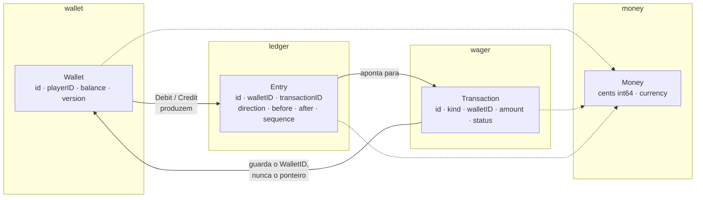
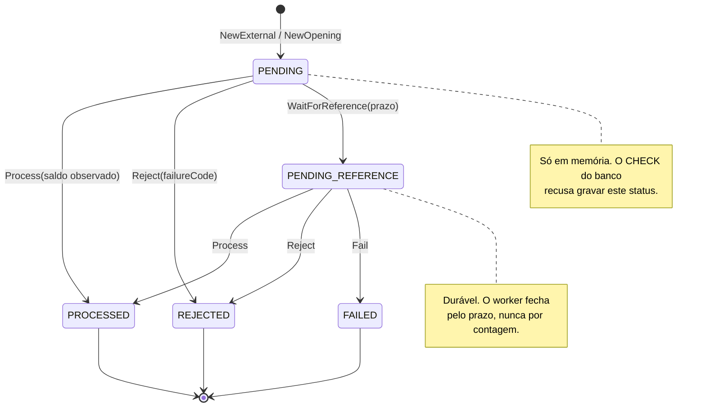

# Domínio

O domínio é um bounded context: liquidação de apostas. Ele importa a biblioteca padrão e os próprios pacotes, e nada mais — Fx, `pgx`, HTTP e SQS ficam em `internal/platform`. Esta página descreve o que existe e como se liga.

## As duas raízes e o que as liga



`Wallet` e `Transaction` são as duas raízes de agregado. A transação guarda a identidade da carteira e nunca a carteira: cada uma é carregada, travada e gravada por si.

`Entry` não é agregado. Nasce dentro de `Wallet.move`, é inserida uma vez e nunca muda — o tipo não tem setter, o papel SQL não tem `UPDATE` e um gatilho recusa a alteração. A carteira diz onde o saldo está; o ledger diz como ele chegou lá, e a reconciliação é a prova de que os dois concordam.

`Money` é valor: dois campos privados, comparável por `==`, copiado por valor. O zero value não tem moeda e é inválido — e é exatamente `Currency().IsZero()` que o sistema inteiro usa para distinguir *ausente* de *zero*.

## Os seis tipos de operação

| Kind | Chama | Cita outra? | Quantia | Move saldo | Versão | Lançamento |
| --- | --- | --- | --- | --- | --- | --- |
| `OPENING` | `wallet.Open` | não | ≥ 0 | se > 0 | nasce em 1 | se > 0 |
| `BET` | `Debit` | não | > 0 | ↓ | +1 | sim |
| `WIN` | `Credit` | opcional | > 0 | ↑ | +1 | sim |
| `LOSS` | nada | não | **= 0** | **não** | **igual** | **não** |
| `REFUND` | `Credit` | obrigatório | > 0, integral | ↑ | +1 | sim |
| `ROLLBACK` | `Credit` ou `Debit` | obrigatório | > 0, integral | depende | +1 | sim |

`OPENING` é interna: só `openwallet` a constrói, e `NewExternal` a recusa com `OPENING_NOT_ALLOWED`. `LOSS` fecha a rodada sem tocar a carteira, porque a aposta já debitou no `BET`. `ROLLBACK` é o único cuja direção depende da operação citada: credita se desfaz um `BET`, debita se desfaz um `WIN` ou um `REFUND`.

O pacote `wager` tem uma função por tipo — `Bet`, `Win`, `Loss`, `Refund`, `Rollback` — e nenhuma calcula saldo: quem calcula é `Wallet.move`, único escritor do saldo. O caso de uso escolhe a função pelo `kind` e não faz mais nada com ele.

A citação existe para quem precisa de um **fato** da operação citada para decidir dinheiro: `WIN` precisa saber que a aposta foi `PROCESSED`, `REFUND` precisa do valor integral, `ROLLBACK` precisa do tipo para escolher a direção. `LOSS` não decide dinheiro, então não cita; o vínculo com a aposta é o `roundId`, obrigatório em toda operação externa.

## O ciclo de vida da transação



A máquina inteira é uma tabela de duas linhas em `status.go`:

```go
var allowedTransitions = map[Status][]Status{
    Pending:          {Processed, Rejected, PendingReference},
    PendingReference: {Processed, Rejected, Failed},
}
```

Um status terminal está simplesmente **ausente** da tabela — é isso que o torna imutável sem um caso próprio. Não existe `PROCESSING`: trabalho interrompido é `PENDING`, e `PENDING` não é gravável.

Cada destino exige o que o status carrega, e o agregado e o banco afirmam o mesmo: `PROCESSED` exige saldo observado, `REJECTED` e `FAILED` exigem `failureCode`, `PENDING_REFERENCE` exige próximo instante e prazo. A transição nunca limpa um campo que o destino não carrega — o prazo escrito ao entrar na espera sobrevive à ida para `PROCESSED`, porque a espera é parte do registro.

`FAILED` só cabe numa linha já durável que uma falha permanente de infraestrutura não deixa concluir. Falha transitória desfaz a transação SQL e tenta de novo; ela nunca vira `FAILED`.

## O replay

Replay devolve o resultado gravado e não reaplica a operação. `Transaction.Replay()` responde um `Outcome` — status, saldo observado e `failureCode`, sem método nenhum que mude estado — e reporta se a transação é terminal. Uma que ainda espera não tem resultado a repetir, e responde a espera gravada.

## Os erros do domínio

Duas classes, e elas não se misturam:

- **Rejeição de negócio** é `wager.Rejection`, um valor com token do catálogo fechado de `failureCode`. A carteira responde uma *condição* (`ErrInsufficientFunds`); quem nomeia o *token* é a ação, porque a mesma condição é `INSUFFICIENT_FUNDS` numa aposta e `REVERSAL_INSUFFICIENT_FUNDS` numa reversão.
- **Defeito** é sentinela sem token — `ErrIncompleteTransaction`, `ErrInvalidTransition`, `ledger.ErrBalanceMismatch`. Um defeito nunca chega ao provedor como `failureCode`.

O trajeto completo do erro até a borda está em [05-transversais](05-transversais.md).

## Glossário

| Termo | Significado |
| --- | --- |
| **Provedor** | A casa de jogo que envia apostas. Identidade de negócio: `providerId` no corpo, nas colunas e nos índices únicos. |
| **Cliente** | A credencial que se autenticou no Keycloak (`client_id`). Um provedor pode ter vários clientes. O mapa em `deploy/local/clients.yaml` liga um ao outro. |
| **Jogador** | O dono da carteira. Uma carteira por jogador e moeda. |
| **Carteira** | O agregado que guarda saldo e versão. Não tem provedor. |
| **Operação / transação** | Um pedido do provedor (`BET`, `WIN`…) e o que aconteceu com ele. Uma linha em `wager_transactions`, sempre. |
| **Lançamento** | Uma linha do ledger: um movimento de saldo, imutável. Só existe quando o saldo se move. |
| **Rodada** | `roundId`: a jogada que agrupa `BET`, `WIN`/`LOSS` e reversões. |
| **Citação / referência** | `referenceExternalTransactionId`: a operação que esta desfaz ou paga. |
| **Espera** | `PENDING_REFERENCE`: a citada ainda não chegou pelo outro canal. |
| **Chave de idempotência** | O que identifica uma *chegada*. Escopo no provedor. |
| **Hash do corpo** | O que identifica o *negócio* de uma chegada. Mesma chave, hash diferente é conflito. |
| **Replay** | A resposta gravada, devolvida de novo, sem reaplicar. |
| **Token** | O `failureCode` estável de uma rejeição de negócio. |
| **Saldo observado** | O saldo no instante do commit que fechou a operação. Congelado na linha; é o que o replay devolve. |
| **Desfecho** | O status terminal de uma operação, e o evento que o anuncia. |
