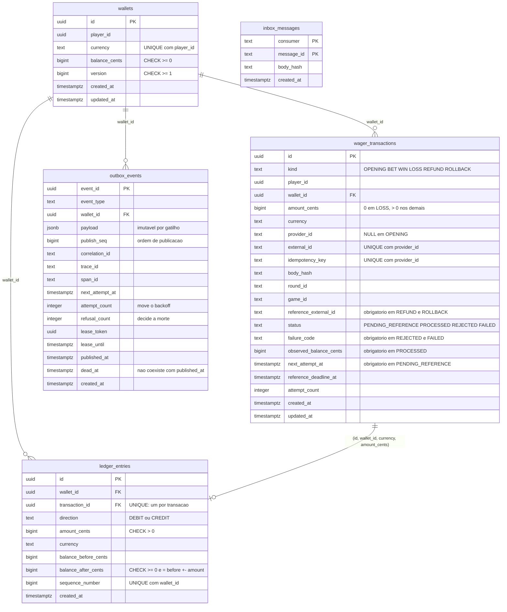

# Dados

Cinco tabelas, um papel SQL e uma regra: o Go pede a escrita, e o commit só permanece se o banco aceitar. O agregado não substitui a constraint — os dois afirmam a mesma invariante, e o banco tem a palavra final.

## O modelo



`inbox_messages` não referencia ninguém: ela deduz a reentrega de uma mensagem, não uma operação. O que a liga ao resto é o commit — a linha da inbox e o lançamento entram na mesma transação SQL.

## O que cada tabela garante

### `wallets`

Uma linha por jogador e moeda (`UNIQUE (player_id, currency)`). Saldo `>= 0` e versão `>= 1` por `CHECK`. A versão sobe exatamente um quando o saldo muda, e é a condição do `UPDATE` — [ADR 0002](adr/0002-lock-pessimista-com-guarda-de-versao.md).

No commit, o saldo é o `balance_after_cents` do último lançamento daquela carteira. O gatilho que compara os dois é `DEFERRABLE INITIALLY DEFERRED`, porque no meio da transação SQL eles divergem de propósito: a carteira é escrita antes do lançamento.

### `wager_transactions`

Uma linha por operação, sempre — inclusive quando nada de dinheiro se move e quando uma regra recusou. Os `CHECK` são a máquina de estados e o acoplamento entre tipo e campos, escritos em SQL:

| Constraint | Afirma |
| --- | --- |
| `status_is_writable` | `PENDING` não é gravável: só existe em memória |
| `amount_matches_kind` | `LOSS` tem quantia zero; os demais, positiva |
| `external_carries_provider_fields` | operação externa tem provedor, id externo, chave, hash, rodada e jogo |
| `opening_is_internal` | `OPENING` não tem nenhum deles |
| `reversal_cites_reference` | `REFUND` e `ROLLBACK` citam alguém |
| `closed_by_rule_names_failure` | `REJECTED` e `FAILED` têm `failure_code` |
| `processed_records_balance` | `PROCESSED` tem saldo observado |
| `waiting_has_next_attempt` / `waiting_has_deadline` | `PENDING_REFERENCE` tem próximo instante e prazo |

Os índices únicos decidem, e não uma consulta prévia que duas réplicas poderiam passar ao mesmo tempo:

| Índice | Escopo | Decide |
| --- | --- | --- |
| `one_per_provider_and_key` | `(provider_id, idempotency_key)` | replay ou `IDEMPOTENCY_CONFLICT` — [ADR 0001](adr/0001-indice-unico-como-arbitro-da-idempotencia.md) |
| `one_per_provider_and_external_id` | `(provider_id, external_id)` | `DUPLICATE_EXTERNAL_TRANSACTION` |
| `one_opening_per_wallet` | `(wallet_id) WHERE kind = 'OPENING'` | uma abertura por carteira |
| `one_processed_reversal_per_reference` | parcial, `PROCESSED` e reversão | **invariante, não árbitro** — [ADR 0003](adr/0003-already-reversed-decidido-sob-o-lock.md) |

E um índice de fila, `wait_queue`, sobre `(next_attempt_at) WHERE status = 'PENDING_REFERENCE'`: é o que serve a varredura do worker de referência sem tocar o resto da tabela.

### `ledger_entries`

Só aceita `INSERT`. Três camadas dizem isso: o tipo `ledger.Entry` não tem setter, o papel `wager_app` só tem `SELECT, INSERT`, e um gatilho recusa `UPDATE`, `DELETE` e `TRUNCATE` — até de superusuário, que passa por cima de qualquer `GRANT`.

A relação com a transação é uma chave estrangeira **composta**:

```sql
FOREIGN KEY (transaction_id, wallet_id, currency, amount_cents)
REFERENCES wager_transactions (id, wallet_id, currency, amount_cents)
```

Um lançamento não pode apontar para uma transação de outra carteira, de outra moeda ou de outra quantia. É por isso que `currency` e `amount_cents` existem em `wager_transactions` como colunas próprias, inclusive num `LOSS` que nunca terá lançamento — [ADR 0005](adr/0005-moeda-denormalizada-na-transacao-e-no-lancamento.md).

`sequence_number` é a versão da carteira depois do movimento, e `UNIQUE (wallet_id, sequence_number)` fecha o ciclo: não existe contador separado para dessincronizar. A ordem de leitura do extrato é `(sequence_number, id)`; `created_at` sozinho não ordena.

### `outbox_events`

Entra no mesmo commit do saldo. `event_id` é a chave e é o que o SNS FIFO usa para deduplicar, então republicar reutiliza o mesmo. O payload é imutável por gatilho — o `UPDATE` que a publicação faz só toca lease, contagens, `published_at` e `dead_at`.

Duas contagens porque são duas perguntas: `attempt_count` sobe em toda falha e move o backoff; `refusal_count` sobe só quando o broker recusou para valer, e é ela que decide a morte — [ADR 0015](adr/0015-duas-contagens-na-outbox.md). `published_at` e `dead_at` não coexistem. O lease é inteiro ou não existe: `(lease_token IS NULL) = (lease_until IS NULL)`.

`publish_seq` é `GENERATED BY DEFAULT AS IDENTITY`, atribuído no `INSERT` — que acontece sob o lock da carteira. É a ordem de publicação, e não `created_at`, que é o relógio do processo lido antes do lock — [ADR 0014](adr/0014-tempo-do-banco-na-outbox.md). O índice `publish_queue` sobre `(wallet_id, publish_seq)`, restrito à linha não publicada e não morta, serve a varredura do relay.

### `inbox_messages`

Uma linha por consumidor e `messageId`, com o hash do corpo que chegou. Só aceita `INSERT`, pelo mesmo gatilho e pelo mesmo `GRANT` do ledger. A inserção roda num savepoint dentro do commit da operação, porque a violação de unicidade abortaria o resto e não sobraria com que comparar o hash — [ADR 0016](adr/0016-inbox-em-savepoint.md).

## Migrations e papel

O SQL versionado fica em `deploy/migrations/`, um par `up`/`down` por passo, aplicado **uma vez antes das réplicas**: no Compose por um serviço que termina, no Kubernetes por um Job. O binário não carrega código de migration.

A primeira migration cria o papel `wager_app` com os privilégios mínimos — `SELECT, INSERT` no ledger e na inbox, `SELECT, INSERT, UPDATE` no resto — e a aplicação entra com `SET ROLE wager_app` em cada conexão do pool. Quem conecta pode ser superusuário; o papel assumido não é, e é ele que os `GRANT` limitam.

| Migration | Introduz |
| --- | --- |
| `000001_financial_schema` | as três tabelas financeiras, os `CHECK`, os índices, os gatilhos e o papel |
| `000002_reference_wait_queue` | o índice da fila de espera e o `CHECK` do prazo |
| `000003_outbox_events` | a outbox, o gatilho de payload imutável |
| `000004_outbox_publish_order` | `publish_seq` e o índice de publicação por ele |
| `000005_outbox_refusal_count` | a segunda contagem |
| `000006_wager_inbox` | a inbox |

A suíte de integração usa um banco próprio, `junglegaming_test`, com o mesmo schema. Migration nova precisa ser aplicada nos dois — o `README.md` diz como.
