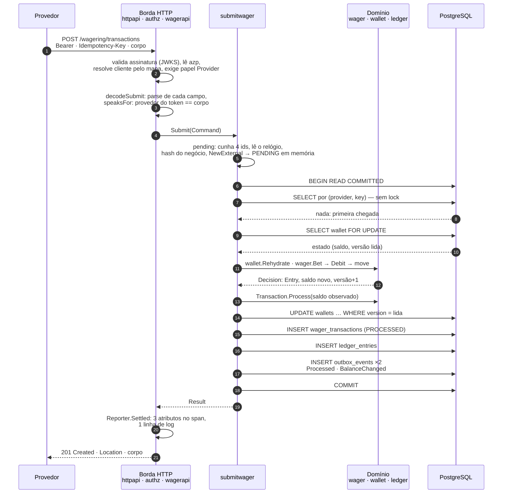
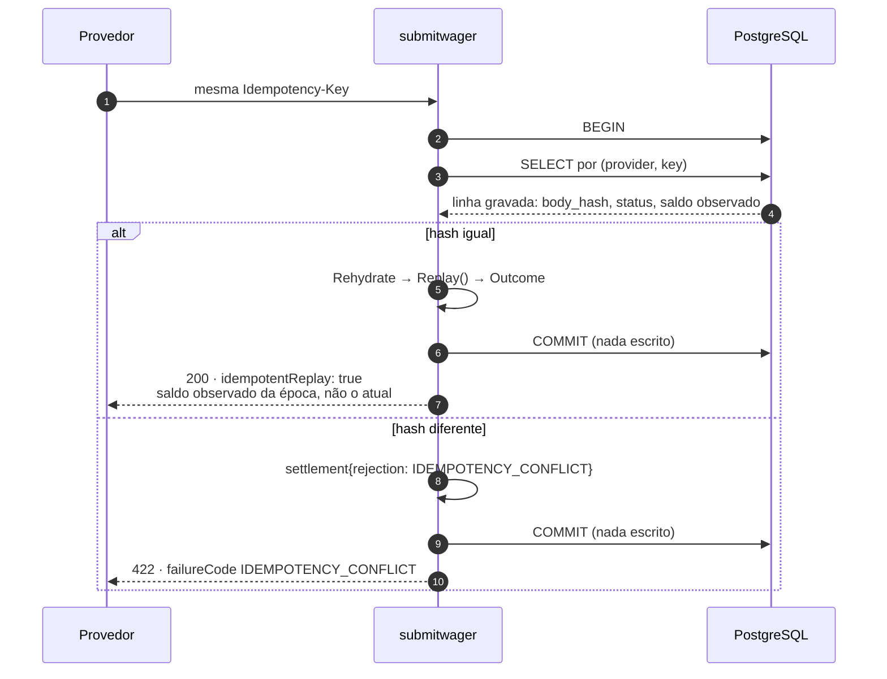
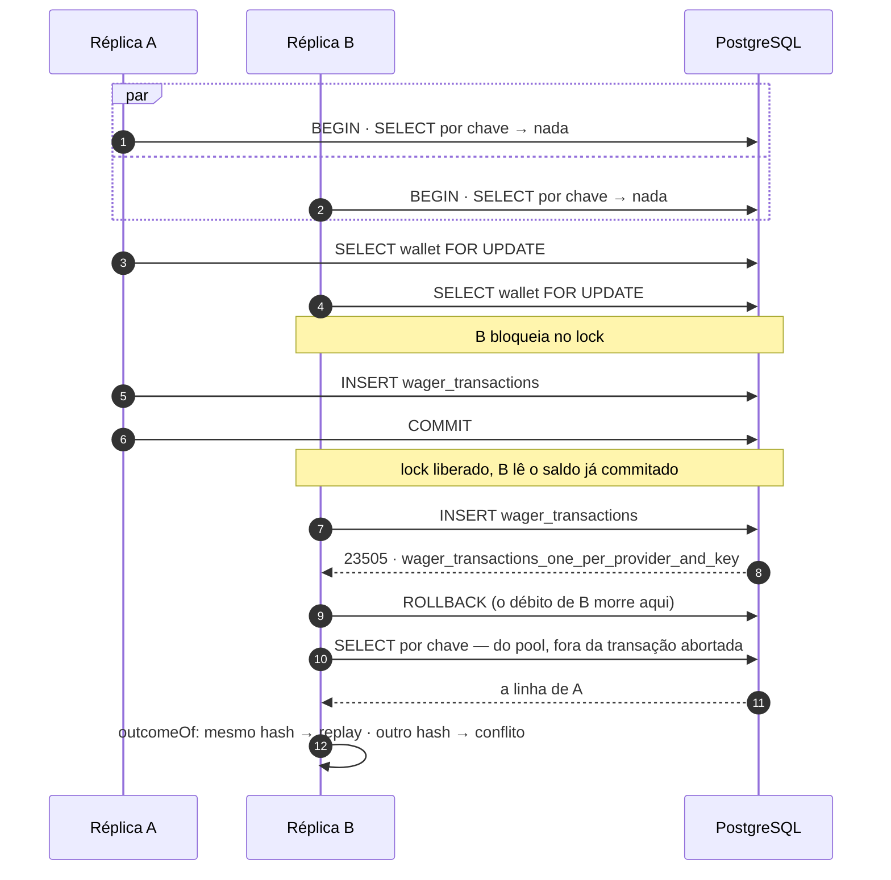
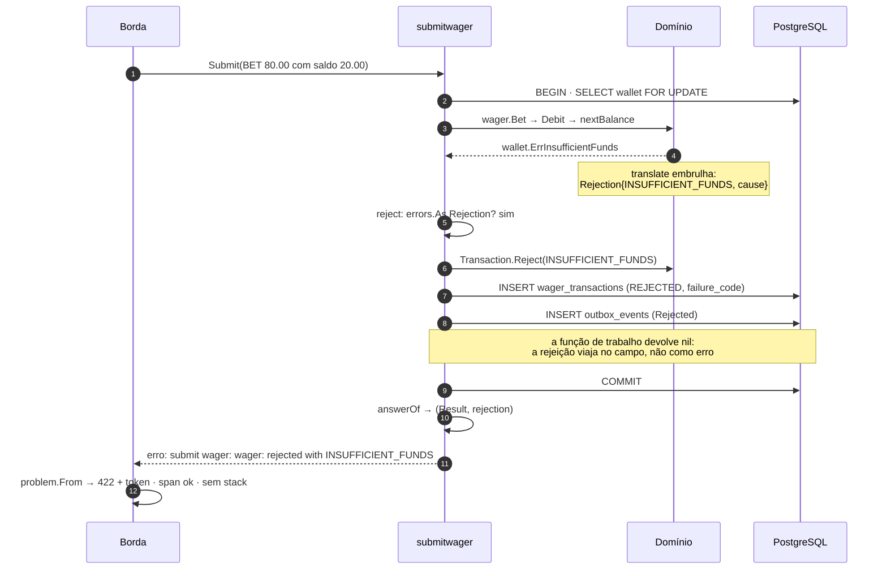
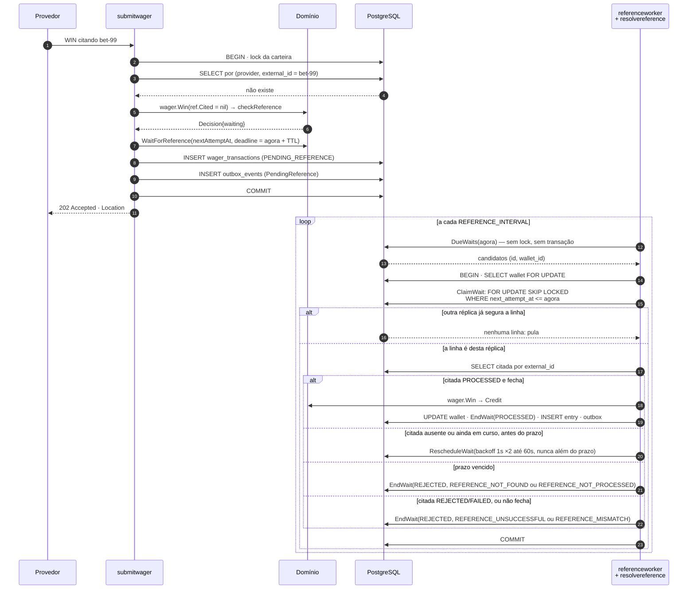
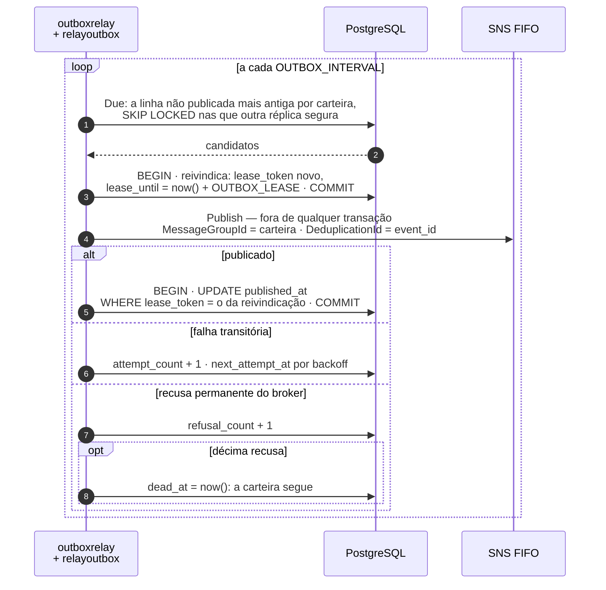
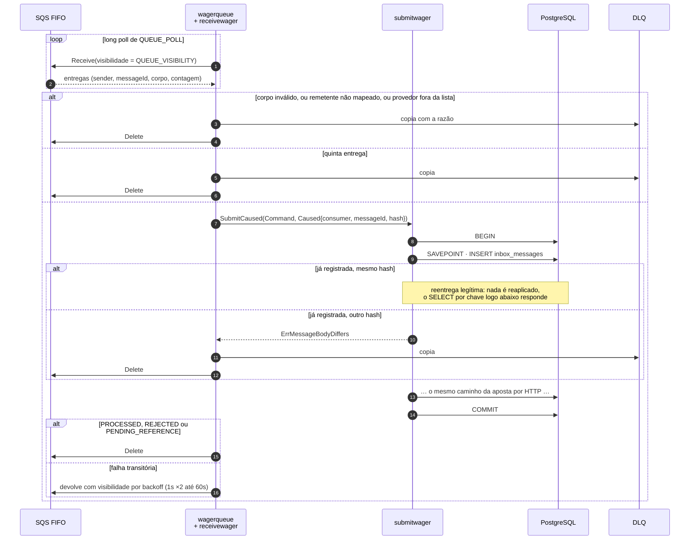
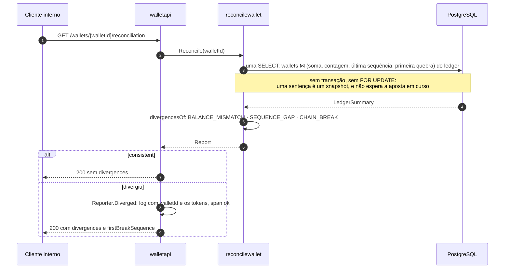

# Fluxos

As sequências que o texto não mostra bem: quem chama quem, em que ordem, e onde a transação SQL abre e fecha. Cada diagrama é um caminho real do código; o nome das funções é o do fonte.

## 1. Uma aposta, do socket ao `201`

A ordem dentro da transação é fixa: chave, carteira, citada, decisão, escrita. É essa ordem que separa uma recusa sem linha de uma rejeição que grava.

## 2. Replay e conflito pelo caminho rápido

A mesma chave chegando depois — retry do provedor por timeout, por exemplo — nunca chega ao lock.

Esta leitura não é o árbitro — é otimização do caso comum. Duas réplicas podem ambas não achar nada; quem decide então é o índice ([ADR 0001](adr/0001-indice-unico-como-arbitro-da-idempotencia.md)).

## 3. A corrida entre réplicas

`afterRace` relê **fora** da transação porque, depois de um erro, o PostgreSQL recusa todo comando até o `ROLLBACK`. Uma chegada gêmea viola os dois índices e o banco nomeia só o primeiro — por isso quem responde é a linha vencedora, não o nome do índice.

## 4. Uma rejeição que deixa linha

Sem versão nova, sem lançamento, sem `WalletBalanceChanged`. A linha `REJECTED` é resultado registrado e consultável ([ADR 0004](adr/0004-rejeicao-duravel-ao-lado-do-resultado.md)).

## 5. A espera por referência, e quem a fecha

Um `WIN` que cita uma aposta ainda não chegada pelo outro canal.

A varredura escolhe candidatos sem lock; a decisão relê a linha **sob** o lock da carteira e é esse estado que vale. A ordem carteira → transação é a mesma da submissão, e é o que impede o worker e uma aposta de se abraçarem ([ADR 0002](adr/0002-lock-pessimista-com-guarda-de-versao.md)).

## 6. O turno do relay da outbox

A publicação fica fora da transação para uma conexão do pool não ficar presa pelo tempo de um broker lento ([ADR 0013](adr/0013-publicar-fora-da-transacao-sob-lease.md)). O lease é medido pelo relógio do banco, e a ordem por carteira é a do `INSERT` sob o lock, não a do instante do evento ([ADR 0014](adr/0014-tempo-do-banco-na-outbox.md)).

## 7. Uma mensagem da fila, do long poll ao `Delete`

HTTP e fila chamam o mesmo caso de uso; o que a fila acrescenta é o par que o HTTP não tem — a identidade do remetente e a memória da mensagem — e a inbox entra no mesmo commit do lançamento ([ADR 0016](adr/0016-inbox-em-savepoint.md)). No `SIGTERM`, a busca é cancelada e a decisão em curso não; a mensagem cortada pelo prazo volta com visibilidade zero.

## 8. As duas leituras da carteira

O extrato segue o mesmo molde com duas idas ao banco — existe a carteira; a página keyset de `limit + 1` linhas sobre `(sequence_number, id)` — porque nada apaga carteira, e a linha excedente é o que diz que há próxima página sem contar a tabela. O cursor decodifica antes de qualquer consulta, e é recusado se foi emitido para outra carteira ([ADR 0023](adr/0023-cursor-opaco-amarrado-a-carteira.md)). A reconciliação lê tudo numa sentença e decide fora dela: o SQL devolve números, e o veredito é regra testável sem banco, que o observador de divergência chama sem passar pela rota ([ADR 0022](adr/0022-reconciliacao-em-uma-sentenca-com-veredito-no-caso-de-uso.md), [ADR 0024](adr/0024-observador-de-divergencia-por-cursor-em-memoria.md)). Nenhuma das duas escreve, e a divergência não marca o span: é um resultado que a leitura relata, não uma falha do serviço.
