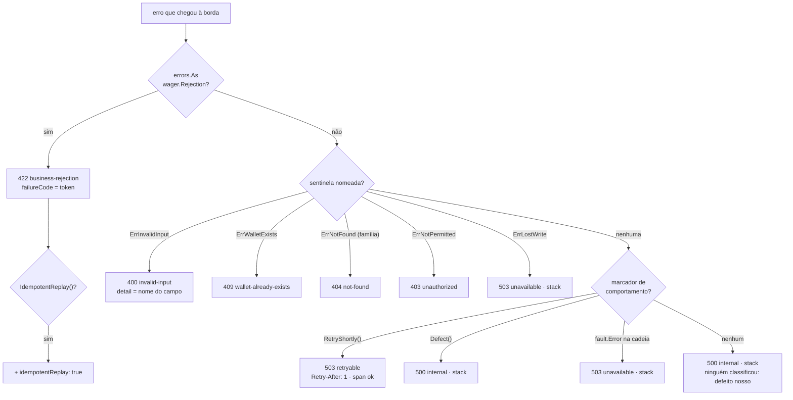

# Conceitos transversais

O que atravessa as três camadas: como um erro viaja, quem pode o quê, o que sai em log e trace, e como o processo sobe e desce.

## Erros

Duas classes, e elas não se misturam.

| | Rejeição de negócio | Falha de infraestrutura |
| --- | --- | --- |
| O que é | uma regra recusou: resultado esperado | o que não devia acontecer: banco fora, prazo, broker |
| Tipo | `wager.Rejection`, com token do catálogo | `*fault.Error` na cadeia, com stack |
| Span | ok | erro |
| Stack | nenhuma | capturada uma vez, na fronteira onde foi vista primeiro |
| HTTP | `422` + `failureCode` | `503` sem token |
| Grava linha? | quando vem de uma ação sobre a carteira travada | nunca: a transação SQL desfaz |

A fronteira entre as duas é desenhada no adaptador SQL: `postgres.wrap` lê o erro do `pgx` e devolve **ou** uma recusa do contrato (violação de índice único → token, sem stack) **ou** `fault.Wrap` (qualquer outra coisa → stack). Nada embrulha uma classe dentro da outra ([ADR 0010](adr/0010-stack-capturada-uma-vez.md)).

### A cadeia

Cada fronteira de pacote embrulha com `fmt.Errorf("<operação>: %w", err)`. A mensagem final lê como trilha — `submit wager: insert transaction: connection refused`. Embrulhar dentro do mesmo pacote engrossa a cadeia sem informação, então `apply`, `record` e `write` passam o erro cru.

Nada é mutado no caminho: cada embrulho é um valor novo que aponta para o anterior, e `errors.Is` e `errors.As` só leem. Um `INSUFFICIENT_FUNDS` ganha dois nós — a `Rejection` em `wager.translate` e o `submit wager:` na saída do caso de uso — e é lido cinco vezes, uma por camada, cada uma perguntando só o que decide.

### A classificação na borda



A ordem importa: uma sentinela que a borda nomeia vence um marcador, para uma condição com resposta conhecida nunca ser lida como indisponibilidade. E o que não carrega marcador nenhum é `500`, não `503`: responder "tente de novo" a um defeito diria ao provedor para repetir o que nunca vai passar.

Os três marcadores — `retryable`, `defective`, `replayed` — são interfaces de um método declaradas em `problem` e satisfeitas por tipos do caso de uso que não sabem disso ([ADR 0008](adr/0008-interfaces-de-comportamento-no-consumidor.md)).

### Três perguntas, três camadas

| Pergunta | Quem faz | Consequência |
| --- | --- | --- |
| tem linha? | `submitwager.reject` | commit ou rollback; com linha, `transactionId` na extensão |
| tem token? | `problem.From` | `422` com `failureCode`, ou outra classe |
| já foi respondido antes? | `problem.isReplay` | `idempotentReplay: true` |

Um campo único não caberia nas três: `AMOUNT_NOT_ALLOWED_FOR_KIND` tem token e não tem linha, porque o `CHECK` recusaria a linha; `INSUFFICIENT_FUNDS` tem os dois; o replay de uma rejeição tem os três.

### Quem loga

Quem retorna erro não loga. Loga quem decide o desfecho — o `Reporter` da borda HTTP, o consumidor da fila, o worker — e loga uma vez, com `fault.Stack(err)` no atributo `stack` quando há. `Detail` no corpo de erro nomeia o campo recusado e nunca o valor: quantia, saldo, chave e credencial não voltam.

## Autorização

O Keycloak emite tokens por `client_credentials`; este serviço não cadastra senha e não emite token. A borda valida assinatura, emissor e validade contra o JWKS do realm, localmente, e lê a claim `azp` — o `client_id` para quem o token foi emitido.

Esse `client_id` é uma **credencial**. O `providerId` é uma **entidade de negócio**. O mapa versionado em `deploy/local/clients.yaml` liga um ao outro, e é a única fonte do provedor pelo qual um request fala:

```
Bearer eyJ…  →  azp = "provider-a"  →  mapa  →  Client{Provider, providerId: "provider-a"}
                                                        ↓
                                    speaksFor: providerId do token == providerId do corpo
                                    ownedExternal: providerId do token == providerId da URL
```

Um provedor pode ter vários clientes — dois datacenters, uma rotação de segredo — e todos operam as mesmas transações. Localmente o `client_id` e o `providerId` são a mesma string, o que esconde a diferença; em produção não são.

| Papel | Pode | Não pode |
| --- | --- | --- |
| **Interno** | abrir carteira, ler carteira, listar o ledger, reconciliar | enviar aposta |
| **Provedor** | enviar aposta, ler a própria transação pela identidade ou pelo identificador externo (inclusive no replay) | abrir carteira, ler saldo, ledger ou reconciliação, ler transação alheia |

Corpo de outro provedor recusa com `403`, sem movimento e sem revelar se a transação existe — uma transação alheia e uma inexistente saem pelo mesmo `404`, porque o provedor é parte da consulta e não de uma checagem depois. O `providerId` da URL da consulta por identificador externo segue a mesma regra: não autoriza, e um que não seja o do token responde a mesma ausência antes de qualquer consulta. `playerId` que não é o dono da carteira rejeita com `PLAYER_WALLET_MISMATCH`, sem movimento.

Credencial ausente, inválida ou expirada é `401`; identidade válida sem permissão é `403`. As duas em problem details, sem dado financeiro. `/health/*` e `/metrics` são públicos.

Na fila não há token: a identidade vem do broker junto da mensagem, e a recusa é ida para a DLQ. O mapa `deploy/local/queue-senders.yaml` é chaveado pela identidade que o consumidor observa, com a lista de provedores permitidos por remetente ([ADR 0019](adr/0019-mapa-de-remetentes-pela-identidade-observada.md)).

## Observabilidade

**Log** em JSON com lista branca de campos: `correlationId`, `trace_id`, `span_id`, `messageId`, `eventId`, `transactionId`, `walletId`, `providerId`, `kind`, `status`, `failureCode`, e `divergences`, os tokens de uma reconciliação que não fechou. O filtro é do handler, não da chamada: atributo fora da lista é descartado antes da saída, então header de autorização, token, corpo, quantia e saldo não vazam nem por engano. Sucesso loga só ids; rejeição, conflito, DLQ e divergência sempre logam.

**Correlação**: no HTTP, `X-Correlation-Id` vale se for token opaco curto, senão o `trace_id`; na fila, o `correlationId` do envelope pela mesma regra, senão o `messageId`. Decidida uma vez na borda, antes do handler, e carregada no contexto — o que a operação grava a leva.

**Trace** por OTLP, com propagação W3C no header HTTP e em atributo da mensagem. Um span da entrada, um do caso de uso, um da unit of work fechado no commit; sem span por query. O nome do span é o padrão da rota, nunca o path com identidade. `REJECTED` deixa o span ok; erro de span é infraestrutura, conflito de versão ou DLQ. A outbox grava `trace_id` e `span_id` do commit, e o relay abre span próprio ligado a eles por *link*, não por paternidade — aquele span fechou no commit, e depois de um restart nem existe.

**Métricas** em `/metrics`, Prometheus, com exemplar de `trace_id` na latência para o p99 abrir o trace. `pprof` escuta em porta própria. Todo rótulo vem de um conjunto que o código fixa — origem, componente, tipo, status, token do catálogo, razão, estado do pool — e nenhum carrega `walletId`, `providerId`, `transactionId`, `messageId` ou `eventId`. As séries de negócio são registradas num lugar só, e cada uma é movida por quem já decide o desfecho que ela conta: o `Reporter` de cada borda, o worker de referência, o relay e o observador.

| Série | Tipo | Rótulos | Quem move |
| --- | --- | --- | --- |
| `wager_settlements_total` | contador | `origin`, `kind`, `status` | cada desfecho gravado, pela borda HTTP, pela fila ou pelo worker que fecha a espera; replay não conta |
| `wager_rejections_total` | contador | `origin`, `failure_code` | cada linha `REJECTED`, pelo token |
| `wager_duplicates_total` | contador | `origin`, `reason` | `replay`, `key_conflict`, `external_duplicate` e `redelivery` |
| `wager_retries_total` | contador | `component`, `reason` | o `503` que pede nova tentativa, a mensagem devolvida com backoff, a linha da outbox de volta ao backoff, a espera reprogramada; o conflito de versão é a razão `version_conflict` |
| `wager_ingress_messages_abandoned_total` | contador | `reason` | cada mensagem copiada para a DLQ |
| `wager_ingress_queue_depth` · `wager_ingress_dead_letter_depth` | gauge | — | o consumidor, uma vez por turno, as duas juntas |
| `wager_outbox_pending_events` · `wager_outbox_oldest_pending_age_seconds` | gauge | — | o relay, depois de cada varredura, pelo relógio do banco |
| `wager_outbox_dead_events_total` | contador | — | a décima recusa permanente |
| `wager_reference_wait_oldest_age_seconds` | gauge | — | o worker de referência, uma vez por turno |
| `wager_reconciliation_wallets_checked_total` | contador | `origin` | cada veredito, da rota (`http`) ou do observador (`watch`) |
| `wager_reconciliation_divergences_total` | contador | `origin`, `divergence` | cada token de divergência de cada veredito |
| `wager_reconciliation_failures_total` | contador | `origin` | cada reconciliação que não produziu veredito: a leitura que falhou ou o número fora do que `Money` representa; a carteira inexistente e a página de carteiras que falha não contam |
| `wager_db_pool_connections` · `wager_db_pool_max_connections` · `wager_db_pool_empty_acquires_total` | gauge e contador | `state` | o próprio pool, no instante do scrape, sem ir ao banco |

Um gauge lido por turno guarda o último valor quando a leitura falha: um gauge que caísse a zero com o broker ou o banco fora leria como uma fila que esvaziou. A divergência é contador e não gauge, e as três séries de reconciliação nascem em zero para toda origem e todo token, para que a primeira divergência ou a primeira falha encontrada já seja uma subida ([ADR 0024](adr/0024-observador-de-divergencia-por-cursor-em-memoria.md), [ADR 0037](adr/0037-serie-e-alerta-do-veredito-que-falha.md)).

Cada réplica é raspada em separado. No Compose, o Prometheus as descobre pelo DNS do Docker e as distingue por `instance`; no cluster, um agente do Prometheus dentro dele descobre os pods e escreve no mesmo Prometheus do Compose, com o rótulo `pod` e os exemplares ([ADR 0035](adr/0035-series-das-replicas-por-agente-com-escrita-remota.md)). Nenhuma consulta do painel nem das regras filtra por `job`, e é isso que as deixa ver os dois modos sem edição.

**Painel e alertas** são arquivos do repositório, carregados na subida. O Grafana provisiona o painel "Liquidação" a partir de `deploy/grafana/dashboards/liquidacao.json`: a divergência dos últimos 15 minutos no topo, e cinco faixas na ordem — saúde e latência, resultado financeiro, fila e referência pendente, outbox, reconciliação. O Prometheus carrega `deploy/prometheus/rules/settlement.yml`, com três regras: `ReconciliationDivergenceFound`, que dispara quando a série de divergência subiu na janela, sem `for`; `OutboxOldestPendingTooOld`, que dispara com o evento pendente mais antigo acima de 30 s por mais de um minuto, a janela que absorve o lease legítimo de um envio; e `ReconciliationVerdictFailed`, que dispara quando o observador não conseguiu produzir o veredito de uma carteira, o estado que a divergência não enxerga — só a origem do observador, porque a falha da rota já foi respondida a quem chamou ([ADR 0037](adr/0037-serie-e-alerta-do-veredito-que-falha.md)). A falha do veredito fica no topo do painel, ao lado da divergência. Não há Alertmanager: o alerta vive no Prometheus, e o Grafana o lista pelo datasource ([ADR 0025](adr/0025-alertas-como-regras-do-prometheus-testadas.md)).

**Saúde**: `/health/live` responde pelo processo; `/health/ready` consulta PostgreSQL e SQS com prazo curto, e ready falho não derruba o live. Os dois e `/metrics` ficam fora do span e do log, porque batem de segundo em segundo.

## Ciclo de vida

O Uber Fx compõe o processo, e `internal/platform/app` é o único pacote que o conhece. A configuração é lida e validada antes de qualquer porta abrir.

A telemetria é a exceção e sobe **antes** de todo o resto, no construtor dela, porque o Fx roda todo construtor antes de todo hook: um start registrado como hook entregaria aos componentes um provider que ele mesmo substituiria depois ([ADR 0021](adr/0021-telemetria-iniciada-no-construtor-antes-dos-hooks.md)).

Subida, nesta ordem: validação da configuração → pool do PostgreSQL → sonda da fila → sonda do tópico → fila de entrada → worker de referência → relay da outbox → observador de divergência → consumidor da fila → servidor HTTP. Nenhum componente de fundo segura a subida com fila vazia ou tabela vazia.

Descida, na ordem inversa, e cada parada com uma **fatia** de `SHUTDOWN_TIMEOUT` (20 s por padrão). O Fx entrega a todos os hooks o mesmo contexto e retorna quando ele vence, pulando o que não alcançou — uma parada que consome o orçamento inteiro leva as de trás consigo. As fatias moram ao lado do registro, e a subida é recusada se o orçamento não paga a soma delas ([ADR 0012](adr/0012-flush-de-telemetria-fora-do-lifecycle.md)).

No `SIGTERM`:

| Componente | Faz | Não faz |
| --- | --- | --- |
| Servidor | para de aceitar; conclui o pedido em curso na sua fatia | |
| Worker de referência | para de reivindicar espera nova | não corta a decisão em curso |
| Relay | para de reivindicar linha; conclui o envio em curso dentro do lease | o sinal não cancela um envio já reivindicado — quem corta é o prazo do processo |
| Consumidor | para de buscar; conclui a decisão em curso no prazo dela | a mensagem cortada pelo prazo volta com visibilidade zero |
| Observador de divergência | não começa turno novo; a leitura em curso é cancelada | não deixa nada pela metade: nada do que ele faz é gravável |
| Telemetria | descarrega o buffer **depois** do ciclo de vida, com 3 s próprios; uma subida que falhou também descarrega | não falha o processo se não conseguir |

No cluster, a terminação de um pod começa pelo `preStop` de 5 s: o endpoint sai do Service e o kube-proxy deixa de mandar conexão nova antes de o `SIGTERM` fechar o servidor. O `terminationGracePeriodSeconds` de 35 s cobre esse atraso, os 20 s de `SHUTDOWN_TIMEOUT` e os 10 s que o Compose já deixa além dele, onde cabe a descarga de 3 s da telemetria ([ADR 0034](adr/0034-cluster-kind-sobre-os-servicos-do-compose.md)). Um pedido que chega numa conexão ociosa que o servidor fechou é reenviado pelo transporte do cliente numa conexão nova, porque um pedido com `Idempotency-Key` é dos que ele reenvia.

Atrás do balanceador do Compose, a parada de uma réplica não aparece para quem chama. A conexão que o servidor recusa depois do `SIGTERM` é o sinal que o balanceador reenvia a outra réplica, e a sonda de `/health/ready`, a cada segundo e com duas falhas, a tira da rotação em até dois segundos. O pedido que já chegou à réplica termina nela, na fatia do servidor, e nunca é reenviado: um `POST /wallets` repetido em outra réplica responderia 409 a quem pediu uma carteira só. Medido sob carga contínua, `docker stop` não fez pedido falhar, e `docker kill` fez falhar só os que estavam em curso na réplica ([ADR 0033](adr/0033-replicas-do-compose-atras-de-um-haproxy.md)).

## Dinheiro

`Money` é `int64` de centavos com a moeda no tipo, escala fixa de duas casas, sem `float` em caminho nenhum. Entra e sai como string decimal. Soma, subtração, negação e parse verificam overflow; comparar ou operar exige a mesma moeda. Vazio, `NaN`, `Infinity`, notação científica, mais de duas casas e negativo são recusados na entrada, não arredondados. O zero value não tem moeda e é inválido, e é essa ausência que o sistema inteiro usa para distinguir *ausente* de *zero* — na coluna, no corpo e no evento. O modelo está em [02-dominio](02-dominio.md).
